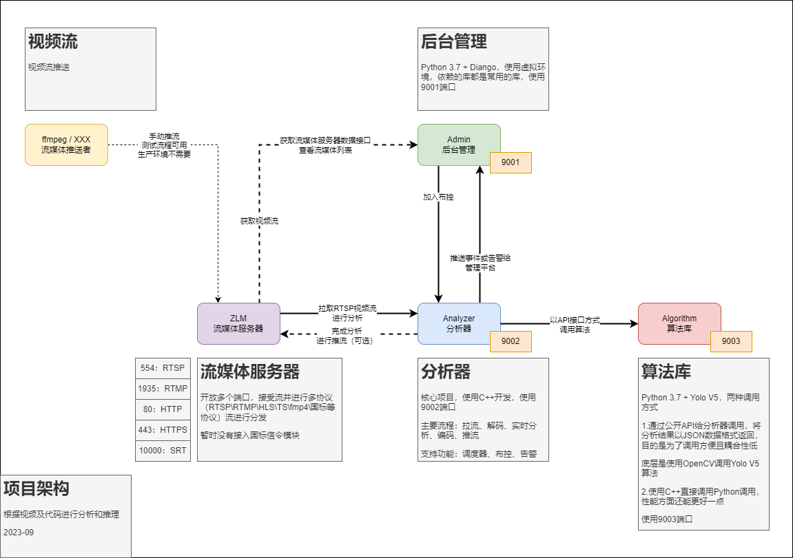

# 视频行为分析

## 整体架构

### 架构图

## 视频教程

* v1版本视频介绍地址 https://www.bilibili.com/video/BV1dG4y1k77o
* v1版本源码讲解（1）拉流，解码，实时算法分析，合成报警视频，编码，推流 https://www.bilibili.com/video/BV1L84y177xc
* v1版本源码讲解（2）音频解码，音频重采样，音频编码，合成报警视频 https://www.bilibili.com/video/BV1984y1L7zB
* C++调用Python，支持传递图片格式的数据，支持调用Python版AI算法模型，C++传递Mat格式的图片数据到Python https://www.bilibili.com/video/BV1Vd4y1p7GE

* v2版本视频介绍地址 https://www.bilibili.com/video/BV1CG411f7ak

* v3版本视频介绍地址 https://www.bilibili.com/video/BV1Xy4y1P7M2
* v3版本安装包下载地址 https://gitee.com/Vanishi/BXC_VideoAnalyzer_v3

### 视频行为分析系统v2

* 作者：北小菜 
* 个人网站：http://www.any12345.com
* 邮箱：bilibili_bxc@126.com
* QQ：1402990689
* 微信：bilibili_bxc

#### 视频行为分析系统v2-源码结构

~~~
（1）Analyzer_v2:  基于C++开发的析器模块，处理视频的拉流、推流、调用算法、合成视频流、警告等
（2）Admin_v2:     基于Python开发的后台管理模块，查看ZLMediaKit的视频流，增加分析视频流的布控
（3）Algorithm_v2: 基于Python开发的算法模块，可扩展算法
（4）zlm:          流媒体服务器模块
~~~

### ffmpeg命令行推流

~~~
//将本地文件推流至VideoAnalyzer（该命令行未经优化，延迟较大）
ffmpeg -re -stream_loop -1  -i test.mp4  -rtsp_transport tcp -c copy -f rtsp rtsp://127.0.0.1:554/live/test

//将摄像头视频流推流至VideoAnalyzer（该命令行已优化，但仍然存在延迟，如果想要彻底解决推流延迟，可以参考我的视频：https://space.bilibili.com/487906612）
ffmpeg  -rtsp_transport tcp -i "视频源地址" -fflags nobuffer -max_delay 1 -threads 5  -profile:v high  -preset superfast -tune zerolatency  -an -c:v h264 -crf 25 -s 1280*720   -f rtsp -bf 0  -g 5  -rtsp_transport tcp rtsp://127.0.0.1:554/live/camera

// 备注
根目录下data文件夹中，我提供了一个test.mp4，大家可以测试，模拟视频流

~~~

### 有关ffmpeg推流的几点补充说明

* 通过ffmpeg命令行实现的推流功能，延迟总是存在的，且无法解决。但基于ffmpeg开发库却可以彻底解决延迟推流的问题，可以参考我的视频：https://space.bilibili.com/487906612

### 这套软件适合哪些人？

~~~
（1）如果是做智慧安防的公司，拿来之后稍微完善包装一下，扩展一下算法功能就能投入实用。
（2）如果是做相关创业的朋友，拿来之后在此基础上二次开发一些功能即可，可以省下一些开发岗位的工作，节省成本。
（3）如果是做算法的朋友，可以套用整个软件的运行流程，只需要扩展自己的算法，就能在此基础上做出比较实用的产品，也可以让自己做的算法快速的形成产品，快速的体验算法的效果。
（4）如果是做算法或软件相关毕业论文的朋友，也可以直接拿来使用，只需要扩展一些功能，即可写出比较不错的论文。
（5）或者从事开发的朋友，可以将该软件作为一个项目案例，也非常不错。

~~~

